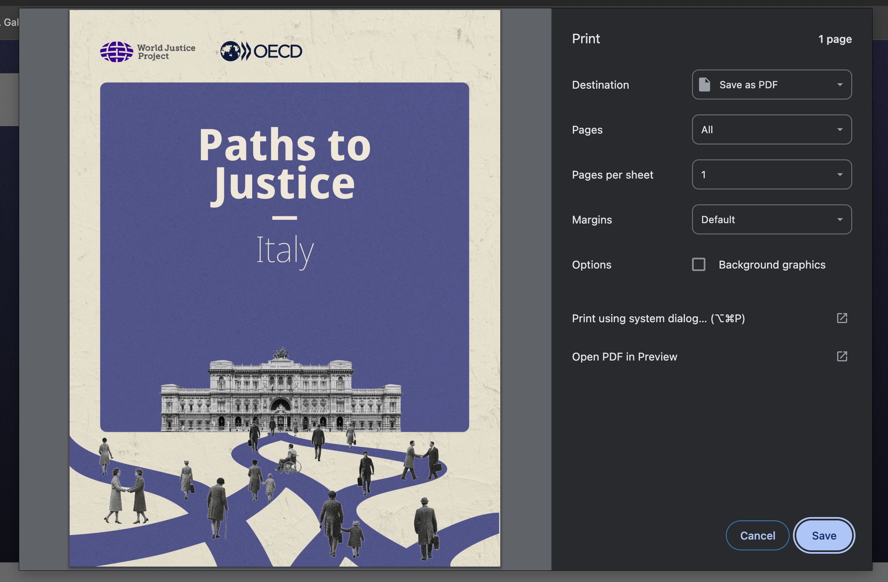

# EU-LNS-Report-Template
Instructions and resources to replicate the Justice Pathways Report in the EU

## Requisites
To replicate the HTML report using Elixir and the Phoenix Web Framework, make sure you have the following installed:

- **Elixir**
  If Elixir is not installed, follow the official installation guide:
  https://elixir-lang.org/install.html
  
  This project was developed using Elixir 1.14. While newer versions may work, they could introduce compatibility issues.

- **Phoenix Framework**
  If Phoenix is not installed, follow the official installation guide:
  https://hexdocs.pm/phoenix/installation.html
  
  This project targets Phoenix ~> 1.7.21. Using newer versions is possible but may lead to compatibility issues.

  > **_WARNING_**: If you install a different version of Phoenix, some adjustments may be needed to this guide.

- **(Optional)**:
  For an improved experience with Elixir and Phoenix, I recommend installig the following VS Code extensions: ElixirLS, Elixir Formatter, Phoenix Framework, 

## Start your Phoenix Server to produce EU LNS Reports

### 1. Generate the Phoenix Project
- Once you have the requisites installed, you need to create a new Phoenix project. You do it by running the following command in your terminal:

  ```bash
  cd path/to/root/directory
  mix phx.new country --no-dashboard --no-ecto --no-gettext --no-mailer
  ```

  This command creates a new Phoenix application named `[country]`, with several optional components disabled. The name of the application should be lowercase, short, and have no symbols. You can read what other options does the `phx.new` command has in the [official documentation](https://hexdocs.pm/phoenix/Mix.Tasks.Phx.New.html). A prompt will appear in the terminal asking you approval to fetch and install the required elixir dependencies. Respond YES and proceed.

### 2. Initiate Git:
- Once you have a working Phoenix project, you need to initiate Git in the newly created project folder by running the following command in your terminal:

  ```bash
  cd [country]
  git init
  ```

- At this point, you can open the project folder using VS Code by running the following command in your terminal:

  ```bash
  code .
  ```

### 3. Custom Stylesheets
- In this template repo, inside the `Resources/Custom CSS/` folder, you will find some custom CSS files. Copy these stylesheets into the `assets/css/` folder in your Phoenix project:
  - `bootstrap-grid.min.css`
  - `bootstrap.min.css`
  - `media-print-styles.css`
  - `sidebar.css`
  - `styles.css`

- We will need to load these new styles to our Phoenix Project. To do so, add the following lines to the `assets/css/app.css` file that was created by default in your Phoenix project:

  ```css
  @import "./bootstrap.min.css";
  @import "./sidebar.css";
  @import "./styles.css";
  @import "./media-print-styles.css";
  ```

### 4. Custom Layouts
- In this template repo, inside the `Resources/Custom Layouts/` folder, you will find some custom HEEX files. Copy these templates into the `lib/country_web/components/layouts/` folder in your Phoenix project:
  - `app.html.heex`
  - `root.html.heex`

> **_IMPORTANT_**: Take a look at the elements in these layout templates and adjust accordingly. If publishing the HTML version, you might also need to adjust the paths and meta tags. See the commented parts of these files.

> **_WARNING_**: Be aware that there inside your newly created Phoenix project, there is a `assets` directory in the root folder. Once you run the Phoenix server for the first time, Phoeniox will automatically create a `priv/static/assets/` folder where it will compile and store all the static assets (CSS, JS, images, etc). Do NOT confuse this folder with the `assets` folder in the root directory of your Phoenix project.

### 5. Static Resources:
- In this template repo, you will find a folder called `Resources/Static Resources/images_layout/`. Copy this folder into your Phoenix project -> `priv/static/images/images_layout/`.

- In this template repo, you will find a file called `Resources/Static Resources/favicon.ico`. Copy this file into your Phoenix project -> `assets/favicon.ico`.

- Before starting to work on this report, you should have the following resources at hand already:
  - **A front cover image**: Please name it `bg-cover.jpg` and add it to the `priv/static/images/` folder in your Phoenix project.
  - **A set of data visualizations**: Add all the figures as SVG files in a new folder called `figures` in the following path of your Phoenix project -> `priv/static/images/figures/`
  - (Optional) Delete the existing `priv/static/images/logo.svg` that was created by default when creating the Phoenix project.

### 6. Master Template:
- In this template repo, you will find a file called `Resources/Master Template/home.html.heex`. Replace the following file in your Phoenix project with this master template -> `lib/country_web/controllers/page_html/home.html.heex`.

> **_IMPORTANT_**: This is the master template that contains all the components and control flow calls to render the report. You will need to adjust it according to your needs.

- In line 12 of the master template (`home.html.heex`), adjust this line to match your country of interest:

  ```html
  <h1>
    Pathways to Justice in COUNTRY
  </h1>
  ```

> **_IMPORTANT_**: The master template has a bunch of lines commented. My suggestion is to start with a light version that has all the components and control flow calls commented to ensure the page loads correctly. Then, as you advance further, you should uncomment and adjust each section as you advance building the report.

### 8. Test the Phoenix Server
- At this point, you should test that everything is ok and working as intended. For this, start your Phoenix server by running the following command in a terminal inside your Phoenix project:

  ```bash
  mix phx.server
  ```

- You should see an output similar to this:

  ```plaintext
  Compiling 12 files (.ex)
  Generated poland app
  [info] Running CountryWeb.Endpoint with Bandit 1.9.0 at 127.0.0.1:4000 (http)
  [info] Access CountryWeb.Endpoint at http://localhost:4000
  [watch] build finished, watching for changes...

  Rebuilding...

  Done in 147ms.
  ```

- Now you can visit [`localhost:4000`](http://localhost:4000) from your browser and preview the report.

- Press CRL+C (MacOS), twice to stop the server if needed.

> **_IMPORTANT_**: At this point, the report will only have the cover page because most components and control flow calls are still commented in the master template.

- The online version of your report will look like this:


- The printed version of your report will look like this:



## Customize the Master Template

### 1. Add outline schema:
- Create a new folder called `lib/country_web/outline/` in your Phoenix project:

  ```bash
  mkdir lib/country_web/outline
  ```

- Add a outline schema file `lib/country_web/outline/outline_schema.ex`. You can find an example in this template repo at `Resources/outline_schema.ex`. Copy and adapt this file into your Phoenix project.

- The outline file is an Elixir module, it should be named as the Phoenix project. For example, if you are working with a Phoenix project called `poland`, the module should be named `PolandWeb.Outline.OutlineSchema`.

  ```elixir
  defmodule PolandWeb.Outline.OutlineSchema do
    def get_outline do
    ...
    end
  end
  ```

- Now that we have the outline schema module, we need to edit the home page controller to pass the outline data to the master template. In the respective page controller file `lib/country_web/controllers/page_controller` import the outline schema module and pass the outline data to the render function. For example, in a Phoenix project called `italy`, you should do the following modifications:

  ```elixir
  defmodule ItalyWeb.PageController do
    use ItalyWeb, :controller

    alias ItalyWeb.Outline.OutlineSchema  # Add this alias

    def home(conn, _params) do
      render(
        conn,
        :home,
        layout: false,
        outline: OutlineSchema.get_outline() # Add this argument
      )
    end
  end
  ```

- This will allow you to access the outline data in the master home template using `@outline`.

### 2. Customizing components:

- Add long, non-reusable components as HEEX files in `lib/italy_web/controllers/page_html/`:
  - The following examples are for reference:
    - `_aboutReport.html.heex`
    - `_acknowledgements.html.heex`
    - `_executiveFindings.hetml.heex`
    - `_findingsSection1.html.heex`
    - `_tableContents.html.heex`

  - You can call them in the home page template using:
  ```elixir
  {_acknowledgements(assigns)}
  ```

- Add reusable components as .ex files in `lib/italy_web/components/`:
  - The following examples are for reference:
    - `chapter_page.ex`
    - `single_panel.ex`
    - `bipanel.ex`

  - Import the components in `lib/italy_web.ex`:
  ```elixir
  import PathwaysToJusticeMaltaWeb.Components.ChapterPage
  import PathwaysToJusticeMaltaWeb.Components.SinglePanel
  import PathwaysToJusticeMaltaWeb.Components.Bipanel
  ```

  - You can call them in the home page template using:
  ```elixir
  <.accordion_component title="Your Title Here">
    Your content here.
  </.accordion_component>
  ```

  > **_IMPORTANT_**: In this template repo, you can find all the reusable and non-reusable components used to render the Justice Pathways Report inside the `Resources/Components/` folder. Reusable components do not need major modifications, while non-reusable components should be adjusted to fit your country data and analysis.

  - **Naming and structure conventions**:
    - Use a leading underscore (`_component_name.html.heex`) for non-reusable partials to clearly distinguish them from full templates.
    - Keep file names descriptive and aligned with report sections to make navigation easier.
    - Group related components (e.g. findings sections) in the same directory to mirror the report structure.

  - **Passing data and assigns**:
    - Both HEEX partials and reusable components receive `assigns` from the parent template.
    - When needed, define and document expected assigns at the top of the component for clarity.
    - Prefer explicit assigns over relying on global state to keep components predictable and easier to reuse.

  - **Slots and content composition (for reusable components)**:
    - Use slots (`<:inner_block>`) to allow flexible content injection while keeping layout logic centralized.
    - This is especially useful for panels, accordions, or repeated report layouts where only the content changes.

  - **Styling considerations**:
    - Keep layout and structure inside components, but avoid hard-coding content-specific styles.
    - Reuse CSS classes consistently across components to maintain visual coherence across the report.

  - **When to create a new component**:
    - Create a reusable `.ex` component when the same layout or UI pattern appears more than once.
    - Use HEEX partials for long, single-use sections where reuse is unlikely and readability matters more.

  - **Testing and iteration**:
    - After adding or modifying components, verify rendering by running the Phoenix server and checking the homepage.
    - Small visual changes are easier to manage when components remain focused and narrowly scoped.

